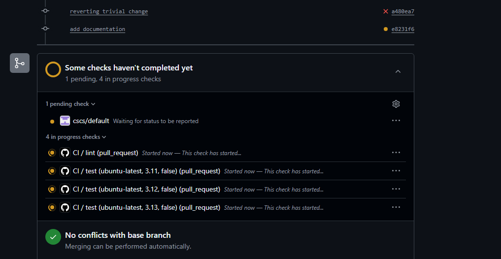
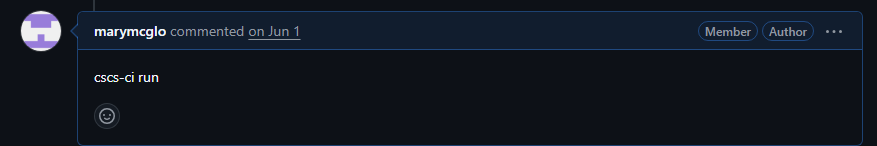

# Configuring CI/CD

Details about using CI/CD in CSCS can be found at https://docs.cscs.ch/services/cicd/.

This was set up using the checklist here: https://docs.cscs.ch/services/cicd/#enable-ci-for-your-project

## Tests run using CI/CD

The configuration `cscs.yml` controls which tests are run. For example,
`unit_test_job` calls the command `pytest tests/unit` (after setting up an environment).
Adding another test suite is relatively simple; just make a new job.

## Using CI/CD
These tests should be triggered automatically in PRs to `main`. When you make a new PR, tests should be triggered automatically. You'll see something like this (look for `cscs/default`):

You can re-trigger tests by adding a comment `cscs-ci run`:

## Admin setup
The CI project `mch-evalml` controls authentication to give CSCS access to the repository, and enables you to determine how the tests are triggered.

The CI administrative setup is available to those with Admin Perimssions which are specified
in the administrative interface. As of 14.7.2026, these users are `mmcgloho,fzanetta,huppd,hdelarou,cmerker,cosuna`.
These users should be able to see `mch-evalml` in their [CSCS CI overview page](https://cicd-ext-mw.cscs.ch/ci/overview), and navigate directly to the [mch-evalml setup](https://cicd-ext-mw.cscs.ch/ci/setup/ui?repo=6067442399726097).

## Troubleshooting

### Disabling and enabling CI/CD
To disable CI/CD (for example, if balfrin is down, or there is some other problem),
navigate to the [administrative interface](https://cicd-ext-mw.cscs.ch/ci/setup/ui?repo=6067442399726097),go to `Default CI enabled branches`, and remove `main` (or any other branches you wish to disable).

To enable, just add it back.

### Tests aren't running.

This could be because the Github key got lost or deleted somehow.
