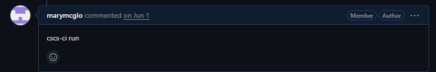
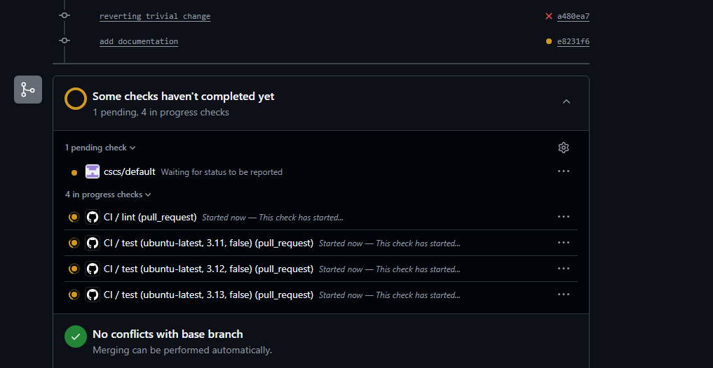

# Configuring CI/CD

Details about using CI/CD in CSCS can be found in [CSCS's documentation](https://docs.cscs.ch/services/cicd/). Specifically, setting this up used the checklist [here](https://docs.cscs.ch/services/cicd/#enable-ci-for-your-project).

## Admin setup
The CI project `mch-evalml` controls authentication to give CSCS access to the repository, and enables you to determine how the tests are triggered.

The CI administrative setup is available to those with Admin Perimssions which are specified
in the administrative interface. As of 14.7.2026, these users are `mmcgloho,fzanetta,huppd,hdelarou,cmerker,cosuna`.
These users should be able to see `mch-evalml` in their [CSCS CI overview page](https://cicd-ext-mw.cscs.ch/ci/overview), and navigate directly to the [mch-evalml setup](https://cicd-ext-mw.cscs.ch/ci/setup/ui?repo=6067442399726097).

## Tests run using CI/CD

`cscs.yml` holds the shared pieces — the bare-metal Balfrin runner definition and
the `.sh_preamble` / `.install_uv` / `.install_evalml` setup fragments. The actual
test suites live in their own files, each `include`-ing `cscs.yml`:

- `longtest.yml` — the `longtest` job: the integration suite marked `longtest`
  (4h Slurm limit).
- `heavytest.yml` — the `heavytest` job: the integration suite marked `heavytest`
  (10h Slurm limit).

Adding another test suite is relatively simple; just make a new job that extends
`.baremetal-runner-balfrin` and runs the tests you want.

### Coverage

Both integration jobs run under `ci/run-integration-coverage.sh <marker>`, which
measures coverage across the full snakemake subprocess chain (including SLURM
jobs) using the subprocess-aware `ci/coverage-integration.cfg`. See the header of
each file for details.

## Using CI/CD from Github
Only a "trusted user" can trigger the CI/CD tests via Github. This is configured
in the CI/CD administrative interface (either Global config or Pipeline config).

You can trigger in one of two ways:
- A trusted user comments "cscs-ci run" into a PR.

- Making `main` (or another branch being merged) a CI-enabled branch. This
will cause tests to trigger anytime a PR is created. However,
*only PRs from a trusted user* will run  successfully. (Otherwise, tests are
triggered and then fail because they cannot be scheduled in CSCS.)

When a test is running, it should look like this:

### Setting up a new Github key

The current Github key is associated with Github user marymcglo. It is set to not
expire, but if it is removed somehow, then a new one will need to be created.
You can create it using instructions in "notification token" in the administrative
interface. *Note: The user will need to have and maintain admin access to the
EvalML Github repo, otherwise it will stop working*.
