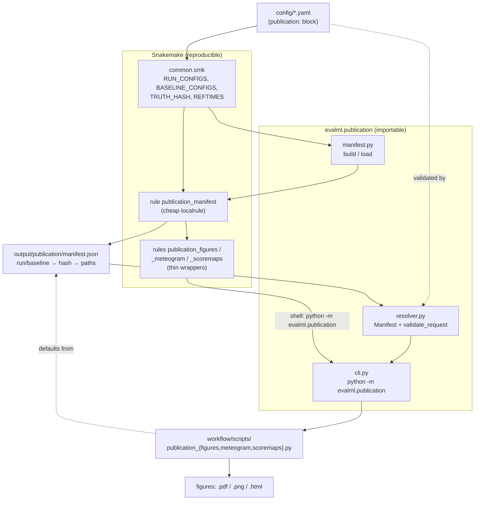
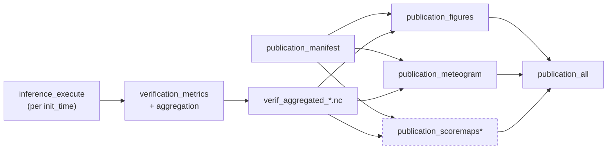

# Publication figures

This document explains the **publication figures** subsystem of `evalml`: why it
was refactored, how it works, and how to produce the figures — both through
Snakemake (reproducible) and standalone (interactive), without ever typing a hash.

---

## TL;DR

```bash
# 1. Reproducible end-to-end (inference → verification → figures), via Snakemake
evalml publication config/varda-single_paper.yaml

# 2. Interactive / re-render from data that already exists (no Snakemake)
evalml make config/varda-single_paper.yaml output/publication/manifest.json  # build the manifest
python -m evalml.publication list                                            # see what's available
python -m evalml.publication figures   --output figures/leadtime
python -m evalml.publication meteogram --output figures/meteogram
python -m evalml.publication scoremaps --output figures/scoremaps            # needs gridded (zarr) truth
```

---

## Why the refactor

The publication workflow grew organically and had two pain points:

1. **Config could express broken states, caught late.** `publication.scoremaps`
   wasn't even in the schema, scoremaps could be requested against
   station-observation truth (which has no spatial maps), and lead-time / baseline
   mismatches only surfaced as cryptic Snakemake graph-expansion errors.

2. **Plotting couldn't realistically run outside Snakemake.** The figure scripts
   are CLI-capable, but to run them by hand you had to hand-assemble cryptic
   identifiers like
   `temporal_downscaler-f927-1ee3-on-forecaster-c304-23e7/495c` and
   `TRUTH_HASH=caa0`, plus the on-disk path conventions — and these were
   hardcoded as *stale* defaults inside the scripts.

The fix keeps the Snakemake/hashing/pydantic foundations and adds a thin,
publication-owned layer on top:

- a **manifest** that persists the run/baseline → hash → data-path mapping,
- a **resolver/validator** that reads it and turns broken requests into clear errors,
- a **CLI** that renders any figure from the manifest,
- **validated config** so incoherent setups fail at load time.

Core inference/verification code is untouched.

---

## Implications for the `main` branch

The refactor was deliberately scoped to the **publication subsystem**. This is what
it means for shared / core code if/when this work is merged toward `main`:

**Not touched (by design).** The inference pipeline, the verification metric/score
computation, and the run/baseline/truth **hashing identity model** in
`common.smk` are unchanged. `env_id`/`run_id`/`TRUTH_HASH` and all existing on-disk
paths are identical, so existing artifacts remain valid and `experiment_all` /
`showcase_all` behave exactly as before.

**Shared files this refactor edits, and why they're safe:**

| File | Change | Backward-compat note |
|------|--------|----------------------|
| `src/evalml/config.py` | Adds `PublicationScoreMapsConfig`, `PublicationConfig.scoremaps`, and a `ConfigModel.validate_publication` cross-field validator. | The new validator only fires when `publication.enabled` is true — configs that don't use the publication block are unaffected. `extra: forbid` was added to `PublicationConfig`, so a misspelled key *under* `publication:` now errors (previously it could slip through). |
| `workflow/rules/common.smk` | `resolve_leadtimes` / `resolve_baseline_id` / `ACCUMULATED_PARAMS` were moved into the importable `evalml.resolution` module and re-imported here. | Pure move — identical behaviour. Existing callers (`plot.smk`, `report.smk`) are unchanged. The only new requirement is that the `evalml` package is importable in the Snakemake process (it already is). |
| `workflow/rules/publication.smk`, `workflow/Snakefile` | New `publication_manifest` rule; the three figure rules became thin CLI wrappers; `publication_all` gained the manifest. | Only the publication target is affected; no other target's DAG changes. |
| `workflow/scripts/publication_*.py` | Defaults now come from the manifest, with a hardcoded fallback. | Behaviour is unchanged when the scripts are driven by the CLI/rules (which always pass explicit args). |

**One cross-cutting invariant to preserve.** `common.smk` now *depends on*
`evalml.resolution`. Keep that module import-light and free of Snakemake globals so
both the workflow process and the standalone CLI/tests can import it.

**Dependency / environment (separate from the code).** Decoding the global ICON
forecast grid for the meteogram requires a matched `eckit` / `eckitlib` /
`eccodeslib` native stack (e.g. the Test PyPI `*.dev103` set). This is **not** a
code change and is **not** pinned in `pyproject.toml`/`uv.lock` yet — it applies to
`main` too (the limitation is pre-existing). Decide separately whether to pin it; a
plain `uv sync` will otherwise revert any manual install.

**Suggested follow-up before merging to `main`:** consolidate the path/layout +
hashing conventions (currently string-built across `verification.smk`, `plot.smk`,
`publication.smk`) into one importable module that the manifest serializes — the
manifest is a deliberate first step in that direction. See the design notes.

---

## Architecture



Key idea: **one resolution path, three entry points.** The Snakemake rules, the
standalone CLI, and the marimo notebooks all resolve data the same way — through
the manifest — so reproducible and interactive runs never drift.

---

## The manifest

A JSON file at `output/publication/manifest.json` (under your config's
`output_root`). It records everything a figure needs, so consumers never recompute
a hash:

```jsonc
{
  "schema_version": 1,
  "master_hash": "78a4",          // digest of the whole config (staleness key)
  "output_root": "output",
  "truth": {
    "label": "SwissMetNet",
    "hash": "caa0",               // TRUTH_HASH
    "type": "jretrieve",          // "jretrieve" (station obs) | "zarr" (gridded)
    "gridded": false
  },
  "dates": { "init_times": ["202504010000", "202504030600", ...] },
  "participants": [
    {
      "id": "temporal_downscaler-f927-...-23e7/495c",
      "label": "Varda-Single", "role": "candidate", "steps": "0/120/1",
      "paths": {
        "verif_aggregated": "output/data/runs/.../495c/verif_aggregated_caa0.nc",
        "grib_dir_template": "output/data/runs/.../495c/{init_time}/grib",
        "scoremap_template": "output/data/runs/.../495c/scoremaps/{param}_{leadtime}_caa0.nc"
      }
    },
    { "id": "baseline-7e02", "label": "ICON-CH1-CTRL", "role": "baseline",
      "steps": "0/33/1", "member": "control", "source_root": "/store_new/.../ICON-CH1-EPS",
      "paths": { "verif_aggregated": "...", "scoremap_template": "..." } }
  ]
}
```

- **Built by** the `publication_manifest` localrule (cheap; runs without the heavy
  data, so paths can be resolved before inference).
- **Regenerated automatically** when the config content changes — `master_hash()`
  is a rule `param`, so Snakemake's `params` rerun-trigger rebuilds it (a no-op
  file touch does *not* trigger it).
- **Found automatically** by the CLI/notebooks at `output/publication/manifest.json`,
  or via `--manifest PATH` / `$EVALML_MANIFEST`.

---

## Configuring the figures

The `publication:` block drives everything and is validated at config load:

```yaml
publication:
  enabled: true
  meteogram:
    init_time: "202504010000"        # must be one of the configured `dates`
    station: "KLO"
    params: [T_2M, TOT_PREC, SP_10M, DD_10M]
  scoremaps:                          # optional; REQUIRES gridded (zarr) truth
    enabled: true
    baseline_label: ICON-CH1-CTRL     # must match a baseline `label` in `runs`
    leadtimes: [6, 24]                # one figure per lead time; each must be
                                      # produced by candidate AND baseline
    # leadtime: 24                    # backward-compat shortcut for leadtimes: [24]
    params: [T_2M, SP_10M]
    scores: [MSE_SKILL, BIAS_CONTRIB]
    region: switzerland
    season: all
```

### Coherence rules (fail at config load, not deep in the run)

| Rule | Rejected when | Message |
|------|---------------|---------|
| scoremaps need gridded truth | `scoremaps.enabled` but `truth` is jretrieve/obs | "requires a gridded (zarr) truth source" |
| leadtime producible | any `scoremaps` lead time (`leadtimes`/`leadtime`) not in candidate **and** baseline `steps` | "leadtime Nh is not produced by …" |
| baseline exists | `scoremaps.baseline_label` not among baselines | "not found. Available baseline labels: […]" |
| meteogram init time | `meteogram.init_time` outside `dates` | "not in the configured initialisation times" |

The same checks run in the resolver, so they also protect standalone/interactive
use that only loads the manifest.

---

## How to run

### A. Reproducible, end-to-end (Snakemake)

```bash
evalml publication config/varda-single_paper.yaml          # full chain
evalml publication config/varda-single_paper.yaml --dry-run   # preview the DAG
evalml publication config/varda-single_paper.yaml --report report.html
```

This builds the manifest, runs inference + verification as needed, then renders
the figures via thin wrapper rules. Figures land under `output/figures/...`.


`*` scoremaps only run when `scoremaps.enabled` **and** truth is gridded.

### B. Standalone CLI (no Snakemake)

Use this to re-render from data that already exists, or to target a custom output
location — it never triggers the inference/verification rerun cascade.

```bash
# ensure the manifest exists (cheap; no inference)
evalml make config/varda-single_paper.yaml output/publication/manifest.json

# discover what's available — no hashes typed
python -m evalml.publication list

# render
python -m evalml.publication figures   --output figures/leadtime
python -m evalml.publication meteogram --output figures/meteogram
python -m evalml.publication scoremaps --output figures/scoremaps
```

Ad-hoc overrides (anything not given falls back to the manifest's configured case):

```bash
python -m evalml.publication meteogram --station GVE --init-time 202504030600
python -m evalml.publication scoremaps --baseline ICON-CH2-CTRL --leadtime 48 --params T_2M,SP_10M
python -m evalml.publication scoremaps --leadtime 6 --leadtime 24   # repeat for one figure per lead time
python -m evalml.publication figures   --manifest /other/output/publication/manifest.json
```

`--output` controls **where figures are written** and is independent of where data
is read (the manifest's `output_root`) — so you can drop paper plots anywhere:

```bash
python -m evalml.publication figures --output /scratch/.../paper_figs/leadtime
```

### C. Interactive notebooks

```bash
export EVALML_MANIFEST=output/publication/manifest.json
marimo edit workflow/scripts/publication_meteogram.py
```

The notebooks load their defaults from the manifest (no cryptic hash defaults). If
no manifest is found they fall back to built-in demo defaults and print a warning.

---

## Where figures are stored

| Path source | Figure | Location | Files |
|---|---|---|---|
| Snakemake | leadtime | `output/figures/leadtime/` | `publication_figures_rmse_bias.pdf/.png`, `..._ets.pdf/.png`, `.html` |
| Snakemake | meteogram | `output/figures/meteogram/` | `publication_meteogram.pdf/.png`, `.html` |
| Snakemake | scoremaps | `output/figures/scoremaps/` | `publication_scoremaps.pdf/.png`, `.html` |
| CLI (default) | any | `./figures/<name>/` (cwd-relative) | same filenames |
| CLI `--output X` | any | `X/` | same filenames |

---

## Troubleshooting

**"Nothing to be done" but figures missing / or a 800-job rerun cascade.**
Snakemake's default rerun-triggers include `code`/`params`; editing code or config
makes it want to recompute everything. If the data already exists and you only want
the figures, either use the standalone CLI (Section B), or restrict triggers:
```bash
evalml publication config/varda-single_paper.yaml -- --rerun-triggers mtime
```

**`MissingInputException` with `--allowed-rules`.** `--allowed-rules` is a strict
whitelist that also forbids the rules producing the inputs. Drop it; use
`--forcerun publication_figures` to force a re-render, or target a rule with
`evalml make` and let Snakemake resolve dependencies.

**Meteogram: `jretrieve credentials not found`.** The meteogram fetches station
obs live from `jretrievedwh`. Put `JRETRIEVE_CLIENT_ID` / `JRETRIEVE_CLIENT_SECRET`
in a `.env` next to `.jretrievedwh-conf.prod.py` (repo root) so they reach SLURM
compute-node jobs too, or run on the login node where your shell already has them.

**Meteogram: `cannot use unstructured grid because gridSpec is not available` /
`'ValueError' object is not callable`.** earthkit/eckit can't decode the global
ICON forecast grid. This needs a matched `eckit`/`eckitlib`/`eccodeslib` native
stack (they are ABI-coupled — bumping one alone breaks `eccodes`). A working set
(from Test PyPI) is `eckit==2.0.8.dev103`, `eckitlib==2.0.8.dev103`,
`eccodeslib==2.48.1.dev103`. This is an environment/dependency concern, not the
figures code.

---

## For developers

```
src/evalml/
  resolution.py          # pure, importable: resolve_leadtimes, resolve_baseline_id
  config.py              # PublicationConfig + PublicationScoreMapsConfig + ConfigModel validators
  publication/
    manifest.py          # build_manifest (pure), write/load
    resolver.py          # Manifest, Participant, validate_request, ResolutionError
    cli.py / __main__.py # python -m evalml.publication
workflow/rules/publication.smk   # publication_manifest + thin figure rules
workflow/scripts/publication_*.py # manifest-aware figure scripts
tests/unit/test_resolution.py, test_publication_config.py, test_publication_manifest.py
```

Design rules of thumb:
- The manifest is the single source of truth for paths; never split a `run_id`
  (it contains `/`), only `str.format`-join templates.
- The Snakemake scoremap input function resolves files from in-memory globals via
  the *same* template the CLI uses, so the declared inputs always match what the
  CLI plots.
- Coherence checks live in `ConfigModel` (fail the launch early) **and** in the
  resolver (protect manifest-only callers).
```
