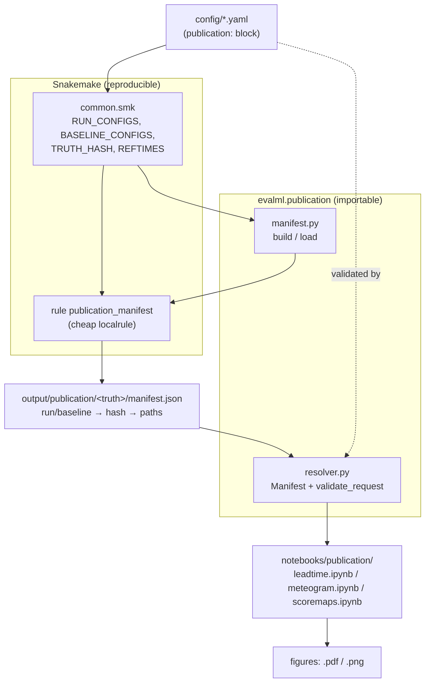
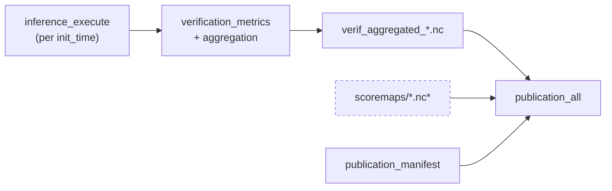

# Publication figures

This document explains the **publication figures** subsystem of `evalml`: why it
was refactored, how it works, and how to produce the figures — both through
Snakemake (reproducible) and via standalone Jupyter notebooks (interactive), without
ever typing a hash.

---

## TL;DR

```bash
# 1. Produce results + manifest (reproducible), via Snakemake
evalml publication config/varda-single_paper_forecaster_scoremaps.yaml

# 2. Render the paper figures (standalone, no Snakemake)
jupyter lab notebooks/publication/       # open leadtime / meteogram / scoremaps
# or headless:
EVALML_MANIFEST=output/publication/<truth>/manifest.json \
  jupyter nbconvert --to notebook --execute --inplace notebooks/publication/leadtime.ipynb
```

---

## Why the refactor

The publication workflow grew organically and had two pain points:

1. **Config could express broken states, caught late.** `publication.scoremaps`
   wasn't even in the schema, scoremaps could be requested against
   station-observation truth (which has no spatial maps), and lead-time / baseline
   mismatches only surfaced as cryptic Snakemake graph-expansion errors.

2. **Plotting couldn't realistically run outside Snakemake.** The figure scripts
   are CLI-capable, but to run them by hand you had to hand-assemble cryptic
   identifiers like
   `temporal_downscaler-f927-1ee3-on-forecaster-c304-23e7/495c` and
   `TRUTH_HASH=caa0`, plus the on-disk path conventions — and these were
   hardcoded as *stale* defaults inside the scripts.

The fix keeps the Snakemake/hashing/pydantic foundations and adds a thin,
publication-owned layer on top:

- a **manifest** that persists the run/baseline → hash → data-path mapping,
- a **resolver/validator** that reads it and turns broken requests into clear errors,
- **standalone Jupyter notebooks** that render any figure from the manifest,
- **validated config** so incoherent setups fail at load time.

Core inference/verification code is untouched.

---

## Implications for the `main` branch

The refactor was deliberately scoped to the **publication subsystem**. This is what
it means for shared / core code if/when this work is merged toward `main`:

**Not touched (by design).** The inference pipeline, the verification metric/score
computation, and the run/baseline/truth **hashing identity model** in
`common.smk` are unchanged. `env_id`/`run_id`/`TRUTH_HASH` and all existing on-disk
paths are identical, so existing artifacts remain valid and `experiment_all` /
`showcase_all` behave exactly as before.

**Shared files this refactor edits, and why they're safe:**

| File | Change | Backward-compat note |
|------|--------|----------------------|
| `src/evalml/config.py` | Adds `PublicationScoremapsConfig`, `PublicationConfig.scoremaps`, and a `ConfigModel.validate_publication` cross-field validator. | The validator only checks a figure whose per-task `enabled` is true — configs that don't use the publication block are unaffected. `extra: forbid` was added to `PublicationConfig`, so a misspelled key *under* `publication:` now errors (previously it could slip through). |
| `workflow/rules/common.smk` | `resolve_leadtimes` / `resolve_baseline_id` / `ACCUMULATED_PARAMS` were moved into the importable `evalml.resolution` module and re-imported here. | Pure move — identical behaviour. Existing callers (`plot.smk`, `report.smk`) are unchanged. The only new requirement is that the `evalml` package is importable in the Snakemake process (it already is). |
| `workflow/rules/publication.smk`, `workflow/Snakefile` | New `publication_manifest` rule; `publication_all` depends on `publication_manifest` + all `verif_aggregated` results (+ scoremap NC files when `publication.scoremaps.enabled`); figures are rendered from the manifest by the notebooks. | Only the publication target is affected; no other target's DAG changes. |

**One cross-cutting invariant to preserve.** `common.smk` now *depends on*
`evalml.resolution`. Keep that module import-light and free of Snakemake globals so
both the workflow process and the standalone notebooks/tests can import it.

**Dependency / environment (separate from the code).** Decoding the global ICON
forecast grid for the meteogram requires a matched `eckit` / `eckitlib` /
`eccodeslib` native stack (e.g. the Test PyPI `*.dev103` set). This is **not** a
code change and is **not** pinned in `pyproject.toml`/`uv.lock` yet — it applies to
`main` too (the limitation is pre-existing). Decide separately whether to pin it; a
plain `uv sync` will otherwise revert any manual install.

**Suggested follow-up before merging to `main`:** consolidate the path/layout +
hashing conventions (currently string-built across `verification.smk`, `plot.smk`,
`publication.smk`) into one importable module that the manifest serializes — the
manifest is a deliberate first step in that direction. See the design notes.

---

## Architecture


```mermaid
flowchart TD
    cfg["config/*.yaml<br/>(publication: block)"]
    subgraph smk["Snakemake (reproducible)"]
        common["common.smk<br/>RUN_CONFIGS, BASELINE_CONFIGS,<br/>TRUTH_HASH, REFTIMES"]
        manrule["rule publication_manifest<br/>(cheap localrule)"]
    end
    manifest["output/publication/&lt;truth&gt;/manifest.json<br/>run/baseline → hash → paths"]
    subgraph pub["evalml.publication (importable)"]
        builder["manifest.py<br/>build / load"]
        resolver["resolver.py<br/>Manifest + validate_request"]
    end
    notebooks["notebooks/publication/<br/>leadtime.ipynb / meteogram.ipynb / scoremaps.ipynb"]
    figs["figures: .pdf / .png"]

    cfg --> common --> manrule --> manifest
    common --> builder --> manrule
    manifest --> resolver --> notebooks --> figs
    cfg -. validated by .-> resolver
```

Key idea: **one resolution path, one rendering entry point.** The Snakemake manifest
rule and the Jupyter notebooks all resolve data the same way — through the manifest
— so reproducible and interactive runs never drift.

---

## The manifest

A JSON file at `output/publication/<truth_slug>/manifest.json` (under your config's
`output_root`), where `<truth_slug>` is a filesystem-safe form of the truth label
(e.g. `SwissMetNet`, `KENDA-CH1`). Namespacing by truth means station-based and
analysis-based runs don't overwrite each other (see *Output namespacing* below). It
records everything a figure needs, so consumers never recompute a hash:

```jsonc
{
  "schema_version": 1,
  "master_hash": "78a4",          // digest of the whole config (staleness key)
  "output_root": "output",
  "truth": {
    "label": "SwissMetNet",
    "slug": "SwissMetNet",        // namespaces the manifest + figure dirs
    "hash": "caa0",               // TRUTH_HASH
    "type": "jretrieve",          // "jretrieve" (station obs) | "zarr" (gridded)
    "gridded": false
  },
  "dates": { "init_times": ["202504010000", "202504030600", ...] },
  "participants": [
    {
      "id": "temporal_downscaler-f927-...-23e7/495c",
      "label": "Varda-Single", "role": "candidate", "steps": "0/120/1",
      "paths": {
        "verif_aggregated": "output/data/runs/.../495c/verif_aggregated_caa0.nc",
        "grib_dir_template": "output/data/runs/.../495c/{init_time}/grib",
        "scoremap_template": "output/data/runs/.../495c/scoremaps/{param}_{leadtime}_caa0.nc"
      }
    },
    { "id": "baseline-7e02", "label": "ICON-CH1-CTRL", "role": "baseline",
      "steps": "0/33/1", "member": "control", "source_root": "/store_new/.../ICON-CH1-EPS",
      "paths": { "verif_aggregated": "...", "scoremap_template": "..." } }
  ]
}
```

- **Built by** the `publication_manifest` localrule (cheap; runs without the heavy
  data, so paths can be resolved before inference).
- **Regenerated automatically** when the config content changes — `master_hash()`
  is a rule `param`, so Snakemake's `params` rerun-trigger rebuilds it (a no-op
  file touch does *not* trigger it).
- **Found automatically** by the notebooks: with one truth present it's
  auto-discovered; with several, pass `truth=<label>` in the notebook cell (or set
  `$EVALML_MANIFEST` to an explicit path).

### Output namespacing

Both the manifest and the figures are namespaced by truth label, so a station-based
(`jretrieve`) and an analysis-based (`zarr`) run coexist instead of overwriting:

```
output/publication/<truth_slug>/manifest.json
output/figures/<truth_slug>/{leadtime,meteogram,scoremaps}/
```

The underlying data is already separated by `TRUTH_HASH`; this extends the same
separation to the manifest and figures. Two truths sharing a label would collide —
labels are expected to be distinct.

---

## Configuring the figures

The `publication:` block drives everything and is validated at config load:

Each figure has its own `enabled` switch — omit a block (or set `enabled: false`)
to skip that figure:

```yaml
publication:
  leadtimes:
    enabled: true                     # lead-time score figures
  meteogram:
    enabled: false
    init_time: "202504010000"        # must be one of the configured `dates`
    station: "KLO"
    params: [T_2M, TOT_PREC, SP_10M, DD_10M]
  scoremaps:                          # REQUIRES gridded (zarr) truth
    enabled: true
    baseline_label: ICON-CH1-CTRL     # must match a baseline `label` in `runs`
    steps: [6, 24]                    # one figure per lead time; each must be
                                      # produced by candidate AND baseline.
                                      # Omit to default to experiment.scoremaps.leadtimes.
    params: [T_2M, SP_10M]
    scores: [MSE_SKILL, BIAS_CONTRIB]
    region: switzerland
    season: all
```

### Coherence rules (fail at config load, not deep in the run)

| Rule | Rejected when | Message |
|------|---------------|---------|
| scoremaps need gridded truth | `scoremaps.enabled` but `truth` is jretrieve/obs | "requires a gridded (zarr) truth source" |
| leadtime producible | any `scoremaps.steps` lead time not in candidate **and** baseline `steps` | "leadtime Nh is not produced by …" |
| baseline exists | `scoremaps.baseline_label` not among baselines | "not found. Available baseline labels: […]" |
| meteogram init time | `meteogram.init_time` outside `dates` | "not in the configured initialisation times" |

The same checks run in the resolver, so they also protect notebook-only/interactive
use that loads only the manifest.

---

## How to run

### A. Reproducible, end-to-end (Snakemake)

```bash
evalml publication config/varda-single_paper.yaml          # full chain
evalml publication config/varda-single_paper.yaml --dry-run   # preview the DAG
evalml publication config/varda-single_paper.yaml --report report.html
```

This builds the manifest, runs inference + verification as needed, and stops.
Figures are rendered from the manifest by the notebooks (Section B below).


```mermaid
flowchart LR
    A["inference_execute<br/>(per init_time)"] --> B["verification_metrics<br/>+ aggregation"]
    B --> C["verif_aggregated_*.nc"]
    C --> ALL
    SC["scoremaps/*.nc*"] --> ALL
    M["publication_manifest"] --> ALL["publication_all"]
    classDef opt stroke-dasharray: 4 4
    class SC opt
```
`*` scoremap NC files only included when `scoremaps.enabled` **and** truth is gridded.

### B. Rendering the figures (notebooks)

The three notebooks in `notebooks/publication/` are standalone — they load the
manifest, resolve all paths through the `Manifest` API, apply the shared
`evalml.publication.style` matplotlib style, and write figures to
`output/figures/<truth_slug>/<figure>/` via `figures_dir(m.output_root, m.truth["label"])`.

| Notebook | Figures produced |
|---|---|
| `leadtime.ipynb` | Lead-time score curves (RMSE/bias/ETS) |
| `meteogram.ipynb` | Single-station meteogram (requires jretrieve + eckit stack) |
| `scoremaps.ipynb` | Spatial skill-score maps (requires gridded/zarr truth) |

**Manifest discovery** (precedence, highest first):

1. `$EVALML_MANIFEST` environment variable — explicit path.
2. `truth=<label>` keyword in the notebook's `load_manifest()` call — selects among
   several auto-discovered manifests.
3. Auto-discovery: if exactly one manifest exists under `output/publication/`, it is
   used without any argument.

**Configured defaults** come from the `publication:` block written into the manifest
at build time. Every parameter (station, init time, steps, params, …) can be
overridden in the notebook cell where `m.validate_request(...)` is called — change
the value in that cell and re-run.

**Interactive (Jupyter Lab):**

```bash
jupyter lab notebooks/publication/
```

**Headless (nbconvert):**

```bash
EVALML_MANIFEST=output/publication/SwissMetNet/manifest.json \
  jupyter nbconvert --to notebook --execute --inplace \
  notebooks/publication/leadtime.ipynb
```

---

## Where figures are stored

Notebooks write figures to `output/figures/<truth_slug>/<figure>/` by default,
resolved via `figures_dir(m.output_root, m.truth["label"])`:

| Figure | Location | Files |
|---|---|---|
| leadtime | `output/figures/<truth>/leadtime/` | `publication_figures_rmse_bias.pdf/.png`, `..._ets.pdf/.png` |
| meteogram | `output/figures/<truth>/meteogram/` | `publication_meteogram.pdf/.png` |
| scoremaps | `output/figures/<truth>/scoremaps/` | `publication_scoremaps_<param>_<step>.pdf/.png` |

---

## Troubleshooting

**"Nothing to be done" but figures missing / or a 800-job rerun cascade.**
Snakemake's default rerun-triggers include `code`/`params`; editing code or config
makes it want to recompute everything. If the data already exists and you only want
to re-render figures, just run the notebook — it never triggers the
inference/verification cascade. To also avoid a Snakemake rerun for the manifest,
restrict triggers:
```bash
evalml publication config/varda-single_paper.yaml -- --rerun-triggers mtime
```

**To re-render without any Snakemake rerun, just run the notebook** — it reads only
the manifest and the already-computed result files, so it never triggers the
inference/verification cascade.

**Meteogram: `jretrieve credentials not found`.** The meteogram fetches station
obs live from `jretrievedwh`. Put `JRETRIEVE_CLIENT_ID` / `JRETRIEVE_CLIENT_SECRET`
in a `.env` next to `.jretrievedwh-conf.prod.py` (repo root) so they reach SLURM
compute-node jobs too, or run on the login node where your shell already has them.

**Meteogram: `cannot use unstructured grid because gridSpec is not available` /
`'ValueError' object is not callable`.** earthkit/eckit can't decode the global
ICON forecast grid. This needs a matched `eckit`/`eckitlib`/`eccodeslib` native
stack (they are ABI-coupled — bumping one alone breaks `eccodes`). A working set
(from Test PyPI) is `eckit==2.0.8.dev103`, `eckitlib==2.0.8.dev103`,
`eccodeslib==2.48.1.dev103`. This is an environment/dependency concern, not the
figures code.

---

## For developers

```
src/evalml/
  resolution.py          # pure, importable: resolve_leadtimes, resolve_baseline_id
  config.py              # PublicationConfig + PublicationScoreMapsConfig + ConfigModel validators
  publication/
    manifest.py          # build_manifest (pure), write/load
    resolver.py          # Manifest, Participant, validate_request, ResolutionError
    style.py             # mplstyle_path() + packaged publication.mplstyle
notebooks/publication/
  leadtime.ipynb         # lead-time score figures
  meteogram.ipynb        # single-station meteogram
  scoremaps.ipynb        # spatial skill-score maps
workflow/rules/publication.smk   # publication_manifest rule; publication_all target
workflow/scripts/
  verification_plot_metrics.py   # shared metric-plotting helpers (used by leadtime notebook)
  meteogram_derivations.py       # derived-variable helpers (used by meteogram notebook)
tests/unit/
  test_resolution.py
  test_publication_config.py
  test_publication_manifest.py
  test_publication_style.py
```

Design rules of thumb:
- The manifest is the single source of truth for paths; never split a `run_id`
  (it contains `/`), only `str.format`-join templates.
- The Snakemake scoremap input function resolves files from in-memory globals via
  the *same* template the notebooks use, so the declared inputs always match what the
  notebooks plot.
- Coherence checks live in `ConfigModel` (fail the launch early) **and** in the
  resolver (protect manifest-only callers).
- Notebooks reach `workflow/scripts/` helpers via a small kernel-safe bootstrap that
  prepends `workflow/scripts` and `src` to `sys.path` at the top of each notebook.
