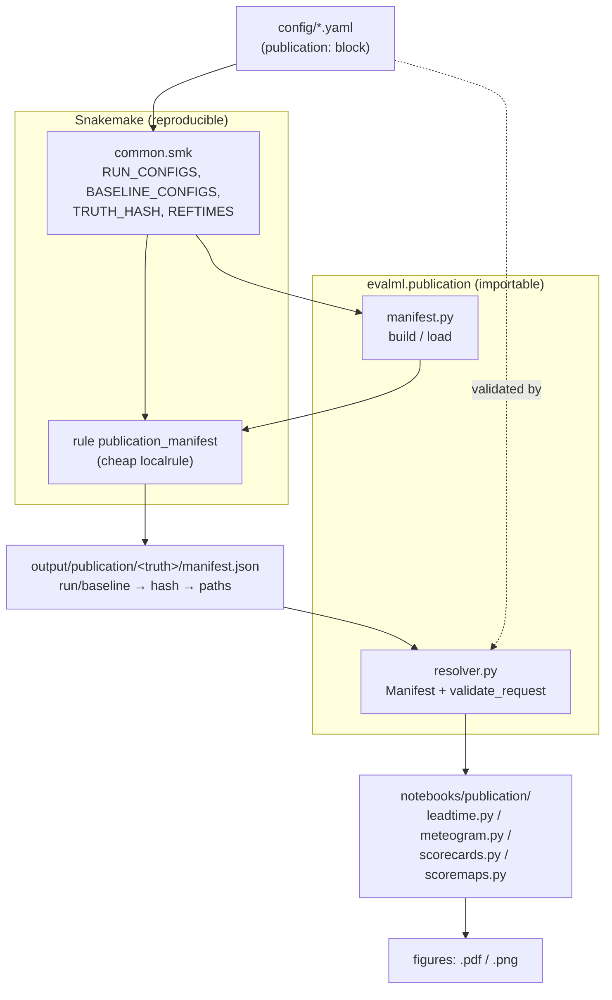
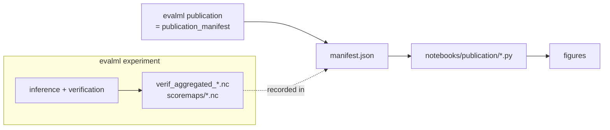

# Publication figures

This document describes the **publication figures** subsystem of `evalml`: how it
works and how to produce the figures — both through Snakemake (reproducible) and via
standalone Marimo notebooks (interactive), without ever typing a hash.

---

## TL;DR

```bash
# 1. Produce the results (verification NC files, scoremaps, …) via the experiment workflow
evalml experiment config/varda-single_paper_stations.yaml

# 2. Write the manifest (run/baseline -> hash -> paths) — cheap, no data recomputed
evalml publication config/varda-single_paper_stations.yaml

# 3. Render the paper figures (standalone, no Snakemake)
marimo edit notebooks/publication/leadtime.py   # or meteogram.py / scoremaps.py
# or headless:
EVALML_MANIFEST=output/publication/<truth>/manifest.json \
  marimo run notebooks/publication/leadtime.py
```

`evalml publication` **only writes the manifest** — the result files come from
`evalml experiment` (step 1). The manifest just records where they live, so you
can (re)generate it independently and re-run step 1 whenever the data changes.

---

## Architecture


```mermaid
flowchart TD
    cfg["config/*.yaml<br/>(publication: block)"]
    subgraph smk["Snakemake (reproducible)"]
        common["common.smk<br/>RUN_CONFIGS, BASELINE_CONFIGS,<br/>TRUTH_HASH, REFTIMES"]
        manrule["rule publication_manifest<br/>(cheap localrule)"]
    end
    manifest["output/publication/&lt;truth&gt;/manifest.json<br/>run/baseline → hash → paths"]
    subgraph pub["evalml.publication (importable)"]
        builder["manifest.py<br/>build / load"]
        resolver["resolver.py<br/>Manifest + validate_request"]
    end
    notebooks["notebooks/publication/<br/>leadtime.py / meteogram.py /<br/>scorecards.py / scoremaps.py"]
    figs["figures: .pdf / .png"]

    cfg --> common --> manrule --> manifest
    common --> builder --> manrule
    manifest --> resolver --> notebooks --> figs
    cfg -. validated by .-> resolver
```

Key idea: **one resolution path, one rendering entry point.** The Snakemake manifest
rule and the Jupyter notebooks all resolve data the same way — through the manifest
— so reproducible and interactive runs never drift.

---

## The manifest

A JSON file at `output/publication/<truth_slug>/manifest.json` (under your config's
`output_root`), where `<truth_slug>` is a filesystem-safe form of the truth label
(e.g. `SwissMetNet`, `KENDA-CH1`). Namespacing by truth means station-based and
analysis-based runs don't overwrite each other (see *Output namespacing* below). It
records everything a figure needs, so consumers never recompute a hash:

```jsonc
{
  "schema_version": 1,
  "master_hash": "78a4",          // digest of the whole config (staleness key)
  "output_root": "output",
  "truth": {
    "label": "SwissMetNet",
    "slug": "SwissMetNet",        // namespaces the manifest + figure dirs
    "hash": "caa0",               // TRUTH_HASH
    "type": "jretrieve",          // "jretrieve" (station obs) | "zarr" (gridded)
    "gridded": false
  },
  "dates": { "init_times": ["202504010000", "202504030600", ...] },
  "participants": [
    {
      "id": "temporal_downscaler-f927-...-23e7/495c",
      "label": "Varda-Single", "role": "candidate", "steps": "0/120/1",
      "paths": {
        "verif_aggregated": "output/data/runs/.../495c/verif_aggregated_caa0.nc",
        "grib_dir_template": "output/data/runs/.../495c/{init_time}/grib",
        "scoremap_template": "output/data/runs/.../495c/scoremaps/{param}_{leadtime}_caa0.nc"
      }
    },
    { "id": "baseline-7e02", "label": "ICON-CH1-CTRL", "role": "baseline",
      "steps": "0/33/1", "member": "control", "source_root": "/store_new/.../ICON-CH1-EPS",
      "paths": { "verif_aggregated": "...", "scoremap_template": "..." } }
  ]
}
```

- **Built by** the `publication_manifest` localrule (cheap; runs without the heavy
  data, so paths can be resolved before inference).
- **Regenerated automatically** when the config content changes — `master_hash()`
  is a rule `param`, so Snakemake's `params` rerun-trigger rebuilds it (a no-op
  file touch does *not* trigger it).
- **Found automatically** by the notebooks: with one truth present it's
  auto-discovered; with several, pass `truth=<label>` in the notebook cell (or set
  `$EVALML_MANIFEST` to an explicit path).

### Output namespacing

Both the manifest and the figures are namespaced by truth label, so a station-based
(`jretrieve`) and an analysis-based (`zarr`) run coexist instead of overwriting:

```
output/publication/<truth_slug>/manifest.json
output/figures/<truth_slug>/{leadtime,meteogram,scoremaps}/
```

The underlying data is already separated by `TRUTH_HASH`; this extends the same
separation to the manifest and figures. Two truths sharing a label would collide —
labels are expected to be distinct.

---

## Configuring the figures

The `publication:` block is **optional**. It no longer drives any Snakemake
production (the manifest is built regardless, and results come from the
experiment workflow); instead it does two things:

1. **Sets the notebooks' default case** — the block is copied into the manifest,
   and each notebook reads its defaults (meteogram station/init time/params,
   scoremaps params/steps/baseline) from it. Omit the block and the notebooks
   fall back to their built-in defaults, which you can still override in-cell.
2. **Is validated at config load** (and again in the resolver) so an incoherent
   request fails early with a clear message rather than mid-plot.

```yaml
publication:
  leadtimes:
    enabled: true                     # lead-time score figures
  meteogram:
    enabled: false
    init_time: "202504010000"        # must be one of the configured `dates`
    station: "KLO"
    params: [T_2M, TOT_PREC1, SP_10M, DD_10M]
    # Note: station obs provide accumulation-windowed precip (TOT_PREC1, TOT_PREC6),
    # not bare TOT_PREC.
  scoremaps:                          # REQUIRES gridded (zarr) truth
    enabled: true
    baseline_label: ICON-CH1-CTRL     # must match a baseline `label` in `runs`
    steps: [6, 24]                    # one figure per lead time; each must be
                                      # produced by candidate AND baseline.
                                      # Omit and the scoremaps notebook defaults to [24].
    params: [T_2M, SP_10M]
    scores: [MSE_SKILL, BIAS_CONTRIB]
    region: switzerland
    season: all
```

### Coherence rules (fail at config load, not deep in the run)

| Rule | Rejected when | Message |
|------|---------------|---------|
| scoremaps need gridded truth | `scoremaps.enabled` but `truth` is jretrieve/obs | "requires a gridded (zarr) truth source" |
| leadtime producible | any `scoremaps.steps` lead time not in candidate **and** baseline `steps` | "leadtime Nh is not produced by …" |
| baseline exists | `scoremaps.baseline_label` not among baselines | "not found. Available baseline labels: […]" |
| meteogram init time | `meteogram.init_time` outside `dates` | "not in the configured initialisation times" |

The same checks run in the resolver, so they also protect notebook-only/interactive
use that loads only the manifest.

---

## How to run

### A. Produce the results (Snakemake)

The result NC files (verification aggregates, scoremaps, GRIB) are produced by
the **experiment** workflow, driven by the `experiment:` config blocks — not by
the publication target:

```bash
evalml experiment config/varda-single_paper_stations.yaml
evalml experiment config/varda-single_paper_forecaster_scoremaps.yaml   # scoremaps (gridded truth)
```

Scoremaps are produced when `experiment.scoremaps.enabled: true` in the config.

### B. Write the manifest (Snakemake)

```bash
evalml publication config/varda-single_paper_stations.yaml
evalml publication config/varda-single_paper_stations.yaml --dry-run    # preview (one cheap rule)
```

`publication_all` runs a single cheap localrule (`publication_manifest`) and
stops — it records where the results live; it does **not** produce or depend on
them. Regenerate it any time the config changes.


```mermaid
flowchart LR
    subgraph exp["evalml experiment"]
        A["inference + verification"] --> C["verif_aggregated_*.nc<br/>scoremaps/*.nc"]
    end
    M["evalml publication<br/>= publication_manifest"] --> MAN["manifest.json"]
    C -. recorded in .-> MAN
    MAN --> NB["notebooks/publication/*.py"] --> F["figures"]
```

### C. Rendering the figures (notebooks)

The notebooks in `notebooks/publication/` are standalone — they load the
manifest, resolve all paths through the `Manifest` API, apply the shared
`evalml.publication.style` matplotlib style, and write figures to
`output/figures/<truth_slug>/<figure>/` via `figures_dir(m.output_root, m.truth["label"])`.

#### Figure catalog

**`leadtime.py` — Lead-time verification curves.** Scores (RMSE, bias, ETS, …)
plotted against lead time, one line per source (candidate + baselines), for a
chosen region/season/init-hour slice. Produces two figures: raw scores and
skill relative to the candidate.
- *Needs:* a verification manifest (station **or** gridded truth) with
  `verif_aggregated` NC files.
- *Output:* `publication_leadtime.{pdf,png}`, `publication_leadtime_skill.{pdf,png}`,
  `publication_leadtime.html`.

**`meteogram.py` — Station meteograms (panel-driven).** Per-station forecast
time series (2m temperature, pressure, wind speed/direction, U/V wind
components, and station A−B differences such as PMSL ALT−LUG), one line per
source over the forecast range. Layout is an explicit `PANELS` grid — each
panel places a param (or a difference) at a `(row, col)` cell; the
`comparison_panels()` helper builds a multi-station comparison (e.g. SIO vs
KLO).
- *Needs:* a meteogram manifest (candidate GRIB under `output/`, baseline
  ICON-EPS archive refs), station observations from jretrieve, and the matched
  eccodes/eckit stack. EPS-mean baselines average the whole ensemble and are
  slow (~40 min/column); CTRL members are single-member and fast.
- *Output:* `publication_meteogram.{pdf,png,html}`.

**`scorecards.py` — Scorecard tables.** Candidate skill against a baseline as a
coloured grid of variable × lead time, split into sections (e.g. short-range vs
`ICON-CH1-CTRL` at `6/33/6`, medium-range vs `ICON-CH2-CTRL` at `24/120/24`),
scores RMSE + ETS, stratified by region.
- *Needs:* a verification manifest (station truth) containing the referenced
  baselines.
- *Output:* `publication_scorecard.{pdf,png}`, `publication_scorecards.html`.

**`scoremaps.py` — Spatial skill-score maps.** 2-D skill maps (MSE skill and the
bias contribution to it) for each parameter at chosen lead times, candidate vs
baseline; plus a per-season variant.
- *Needs:* a **gridded (zarr) truth** manifest with scoremap NC files (produced
  via `experiment.scoremaps` / `publication.scoremaps`); earthkit + cartopy.
- *Output:* `publication_scoremaps_<lt>h.{pdf,png}`,
  `publication_scoremaps_seasonal_<lt>h.{pdf,png}`, `publication_scoremaps.html`.

**`plot_meteogram_region.py` — Region areal-mean time series (Valais precip
case study).** A **standalone script** (not a marimo notebook, and not
manifest-driven): it averages the truth over the points inside a region polygon
and plots the series in the shared publication style. Single-column figure
(3.35 in). Run it by hand:

```bash
python workflow/scripts/plot_meteogram_region.py \
  --truth /store_new/mch/msopr/ml/datasets/mch-ich1-1km-2024-2025-1h-pl13-v1.0.zarr \
  --truth_label "KENDA-CH1" \
  --shapefile /store_new/mch/msopr/ml/regions/cantons/valais.shp \
  --date 202506271800 --steps 0/120/1 --param TOT_PREC1 \
  --outfn output/results/valais.png
```

- *Needs:* a truth source (a gridded analysis `.zarr`, or `jretrievedwh:1,2`
  observations) and a region shapefile in EPSG:2056.
- *Output:* the `--outfn` PNG **and a `.pdf` alongside**. Put the region/date in
  the `--outfn` name (there is no on-figure title, by convention).

**Manifest discovery** (precedence, highest first):

1. `$EVALML_MANIFEST` environment variable — explicit path.
2. `truth=<label>` keyword in the notebook's `load_manifest()` call — selects among
   several auto-discovered manifests.
3. Auto-discovery: if exactly one manifest exists under `output/publication/`, it is
   used without any argument.

**Configured defaults** come from the `publication:` block written into the manifest
at build time. Every parameter (station, init time, steps, params, …) can be
overridden in the notebook cell where `m.validate_request(...)` is called — change
the value in that cell and re-run.

**Interactive (Marimo):**

```bash
marimo edit notebooks/publication/leadtime.py
```

**Headless:**

```bash
EVALML_MANIFEST=output/publication/SwissMetNet/manifest.json \
  marimo run notebooks/publication/leadtime.py
```

---

## Where figures are stored

Notebooks write figures to `output/figures/<truth_slug>/<figure>/` by default,
resolved via `figures_dir(m.output_root, m.truth["label"])`:

| Figure | Location | Files |
|---|---|---|
| leadtime | `output/figures/<truth>/leadtime/` | `publication_leadtime.pdf/.png`, `publication_leadtime_skill.pdf/.png`, `publication_leadtime.html` |
| meteogram | `output/figures/<truth>/meteogram/` | `publication_meteogram.pdf/.png/.html` |
| scorecards | `output/figures/<truth>/scorecards/` | `publication_scorecard.pdf/.png`, `publication_scorecards.html` |
| scoremaps | `output/figures/<truth>/scoremaps/` | `publication_scoremaps_<step>h.pdf/.png` (one per lead time), `publication_scoremaps_seasonal_<step>h.pdf/.png`, `publication_scoremaps.html` |

---

## Troubleshooting

**"Nothing to be done" but figures missing / or a 800-job rerun cascade.**
Snakemake's default rerun-triggers include `code`/`params`; editing code or config
makes it want to recompute everything. If the data already exists and you only want
to re-render figures, just run the notebook — it never triggers the
inference/verification cascade. To also avoid a Snakemake rerun for the manifest,
restrict triggers:
```bash
evalml publication config/varda-single_paper_stations.yaml -- --rerun-triggers mtime
```

**Meteogram: `jretrieve credentials not found`.** The meteogram fetches station
obs live from `jretrievedwh`. Put `JRETRIEVE_CLIENT_ID` / `JRETRIEVE_CLIENT_SECRET`
in a `.env` next to `.jretrievedwh-conf.prod.py` (repo root) so they reach SLURM
compute-node jobs too, or run on the login node where your shell already has them.

**Meteogram: `cannot use unstructured grid because gridSpec is not available` /
`'ValueError' object is not callable`.** earthkit/eckit can't decode the global
ICON forecast grid. This needs a matched `eckit`/`eckitlib`/`eccodeslib` native
stack (they are ABI-coupled — bumping one alone breaks `eccodes`). A working set
(from Test PyPI) is `eckit==2.0.8.dev103`, `eckitlib==2.0.8.dev103`,
`eccodeslib==2.48.1.dev103`. This is an environment/dependency concern, not the
figures code.

---

## For developers

```
src/evalml/
  resolution.py          # pure, importable: resolve_leadtimes, resolve_baseline_id
  config.py              # PublicationConfig + PublicationScoremapsConfig + ConfigModel validators
  publication/
    manifest.py          # build_manifest (pure), write/load
    resolver.py          # Manifest, Participant, validate_request, ResolutionError
    style.py             # mplstyle_path() + packaged publication.mplstyle
notebooks/publication/
  leadtime.py            # lead-time score figures
  meteogram.py           # station meteograms (panel-driven; supports station A-B diffs)
  scorecards.py          # combined multi-section scorecard
  scoremaps.py           # spatial skill-score maps
workflow/rules/publication.smk   # publication_manifest rule; publication_all target
workflow/scripts/
  verification_plot_metrics.py   # shared metric-plotting helpers (used by leadtime notebook)
  meteogram_derivations.py       # derived-variable helpers (used by meteogram notebook)
  plot_meteogram_region.py       # standalone region areal-mean figure (Valais precip); uses the shared style
tests/unit/
  test_resolution.py
  test_publication_config.py
  test_publication_manifest.py
  test_publication_style.py
```

Design rules of thumb:
- The manifest is the single source of truth for paths; never split a `run_id`
  (it contains `/`), only `str.format`-join templates.
- `evalml publication` only writes the manifest; result NC files are produced by
  the experiment workflow. The notebooks open whatever result files exist at the
  paths the manifest records — a missing file surfaces as a clear `FileNotFoundError`,
  the cue to (re)run `evalml experiment`.
- Coherence checks live in `ConfigModel` (fail the launch early) **and** in the
  resolver (protect manifest-only callers).
- Notebooks reach `workflow/scripts/` helpers via a small kernel-safe bootstrap that
  prepends `workflow/scripts` and `src` to `sys.path` at the top of each notebook.
- `evalml.resolution` must stay import-light and free of Snakemake globals so that
  `workflow/rules/common.smk`, standalone notebooks, and the test suite can all
  import it without a Snakemake process.
